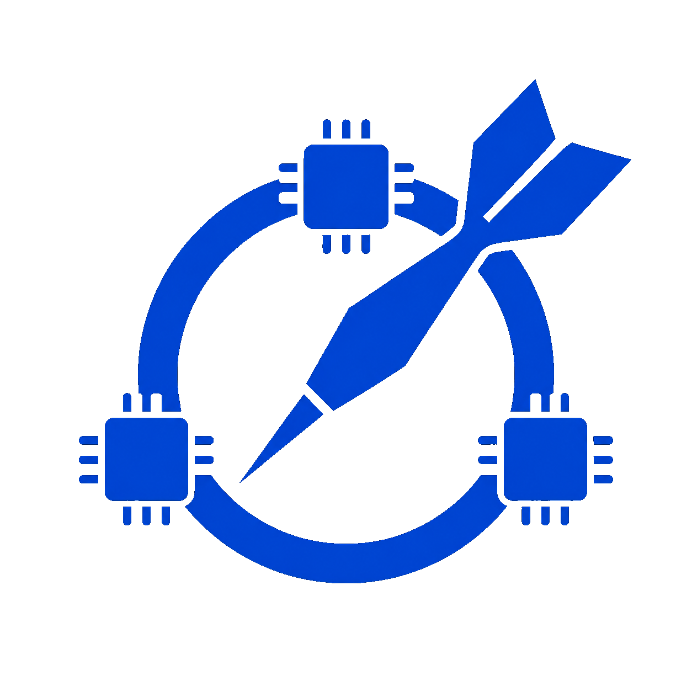

<p align="center">
  
</p>

# Dart Arena

Dart Arena is a Flutter desktop app for benchmarking AI coding models on Dart and Flutter tasks. It helps compare model quality across code generation, agentic execution, hidden verification, repeated trials, and human preference review.

## What it measures

- **Codegen and agentic tracks:** run direct model responses as well as agent-style planning/execution workflows.
- **Task QA and hidden verifiers:** score tasks with compile checks, analyzer checks, visible tests, hidden/reference tests, diff-size signals, and LLM judges.
- **Reliable leaderboards:** repeat trials per task/model combo and aggregate results across quality, speed, reliability, and category dimensions.
- **Human review:** compare competing outputs in a review queue and fold preferences into rankings.
- **Provenance and exports:** save run manifests, environment details, summaries, CSV/Markdown/JSON reports, and reproducible artifact bundles.
- **Headless CI smoke:** exercise the headless benchmark runner in GitHub Actions for release confidence.

## Quick start

Install Flutter for your desktop platform, then run:

```sh
flutter pub get
flutter run -d linux
```

Use `windows` or `macos` instead of `linux` when running on those hosts.

## Provider setup

Open **Settings** in the app to configure model providers. Dart Arena currently supports:

- Ollama Local and Ollama Cloud
- OpenCode Go
- OpenAI
- OpenRouter
- DeepSeek
- Anthropic
- custom OpenAI-compatible local providers
- local Factory Droid execution

API keys and provider base URLs are stored through platform secure storage. Do not commit keys, exported credentials, local databases, or benchmark work directories.

## Running benchmarks

1. Configure at least one provider in **Settings**.
2. Select **New Run**.
3. Choose tasks, providers, models, evaluator settings, concurrency, and trial count.
4. Start the run and monitor progress.
5. Review the leaderboard, inspect task-run details, export run bundles, or compare outputs in the review queue.

## Validation

Use these commands before submitting changes:

```sh
flutter pub get
dart format --set-exit-if-changed lib test
flutter analyze
flutter test
flutter build linux --debug
```

The CI smoke workflow also runs:

```sh
flutter test test/headless/headless_benchmark_runner_test.dart
```

## Desktop builds

Build debug desktop artifacts from the matching host OS:

```sh
flutter build linux --debug
flutter build windows --debug
flutter build macos --debug
```

Cross-building Windows or macOS from Linux is not supported by Flutter, so run those commands on native hosts.

## Privacy and security

- Provider credentials stay in platform secure storage.
- Benchmark tasks and generated work directories may contain model output and code diffs; inspect exported bundles before sharing them.
- Hidden verifier fixtures are part of the local benchmark corpus and should not be exposed to model prompts during a run.
- The app does not require committing local databases, caches, generated build outputs, or exported benchmark artifacts.

## Contributing

Contributions should keep the package/import name as `dart_arena`, preserve benchmark reproducibility, and include tests for scoring, task fixtures, or UI behavior when changed.

Before opening a pull request:

```sh
dart format --set-exit-if-changed lib test
flutter analyze
flutter test
```

## License

Dart Arena is released under the MIT License. See [LICENSE](LICENSE).

---

<p align="center">
  
</p>
